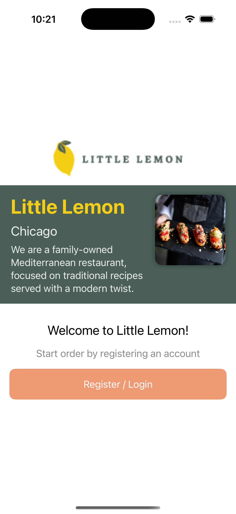
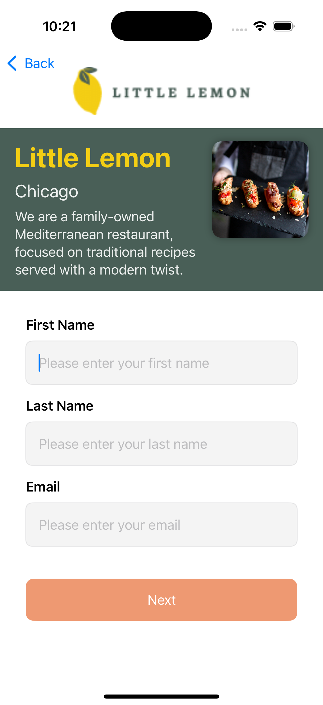
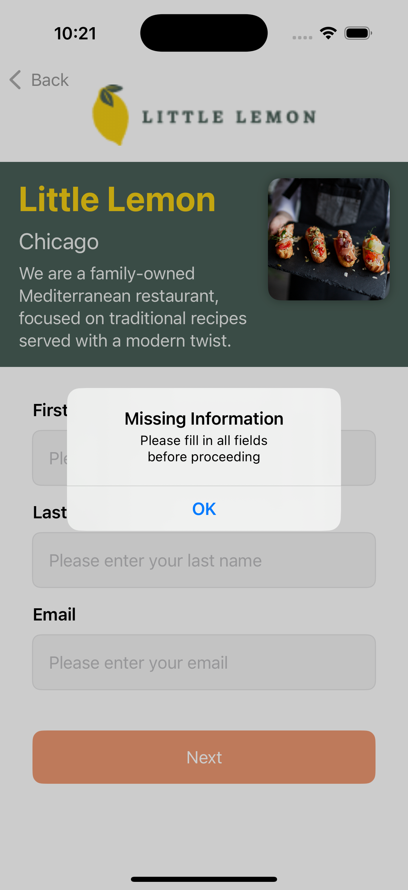
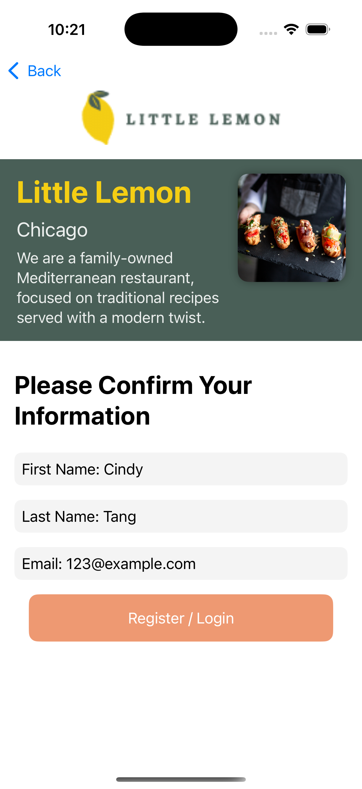
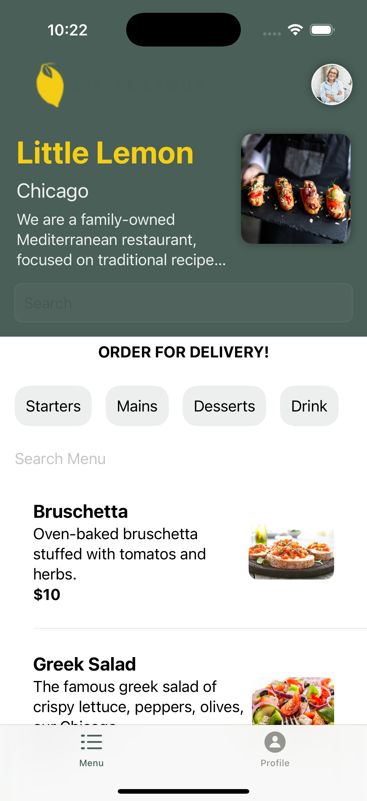
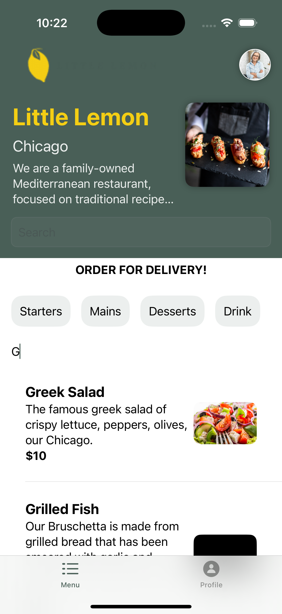
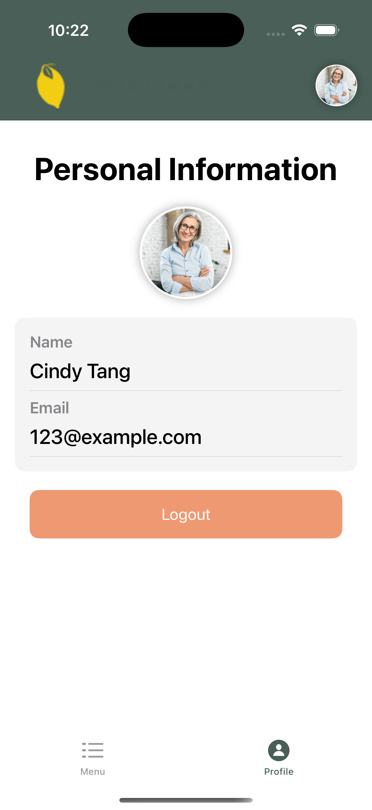

# Little Lemon iOS Application

## Project Overview

The Little Lemon iOS application is a modern and user-friendly app designed for a family-owned Mediterranean restaurant. It allows users to browse the menu, place delivery orders, and manage their profiles. The app is built using SwiftUI and integrates advanced features such as Core Data for local data storage and a RESTful API to fetch live menu data.

## Key Features

- **Onboarding & Registration:** Users can create an account or log in to access personalized features.
- **Menu Display:** The menu is dynamically fetched from a RESTful API and displayed with visually appealing UI components.
- **Order Management:** Users can browse different categories such as Starters, Mains, Desserts, and Sides.
- **Advanced Search & Filtering:** Implemented using `NSPredicate` and `NSSortDescriptor` for efficient searching and sorting of menu items.
- **Profile Management:** Users can view and manage their personal information, including a logout feature.
- **Persistent Data:** Core Data is used to store user information and menu data locally for offline access.

## Skills & Technologies Applied
- **SwiftUI:** Leveraged for building responsive and modern user interfaces.
- **Core Data:** Implemented for persistent local storage of user data and menu items.
- **RESTful API Integration:** Consumed external API to fetch live data for menu items.
- **MVVM Architecture:** Ensured clean separation of UI and business logic, making the app maintainable and testable.
- **Figma for Design:** Created a simple and effective wireframe and UI design using Figma.
- **NSPredicate & NSSortDescriptor:** Enhanced search functionality and sorting of menu items.

## Design Approach
A simple wireframe was designed in Figma to map out the user interface and experience. The design emphasized clarity and ease of use, with a consistent theme that aligns with the brand's colors and aesthetics. The app’s layout was structured around a central navigation with tab views for easy access to the menu and profile sections.

## Screenshots
- Onboarding Screen

    

- Registration Screen

    
    

- Confirmation / Login Screen

    
    

- Menu Screen and filtering function

    
    

- Userprofile and logout

    

## What I Learned
This project helped solidify my understanding of building scalable iOS applications using SwiftUI and integrating essential technologies like Core Data and RESTful APIs. It also enhanced my design skills using Figma and taught me the importance of maintaining a clear and consistent UI/UX throughout the app.

## Future Improvements
- Adding a cart and checkout feature for online ordering.
- Implementing push notifications for promotions and order updates.

## Declaration
This project is an extension of the coursework from the **Coursera Meta Professional Certificate in iOS Development**. While inspired by the course material, this app incorporates unique design choices, additional features, and custom UI elements, demonstrating advanced skills beyond the original coursework.